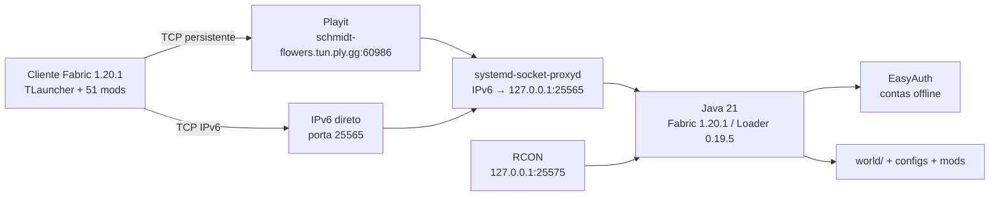
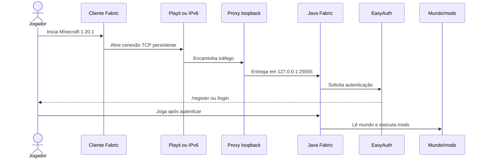
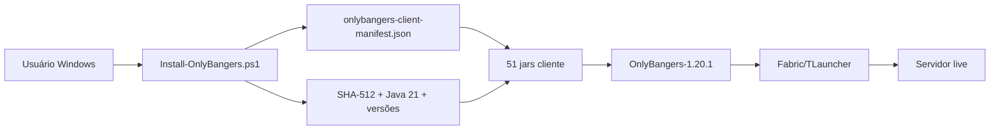
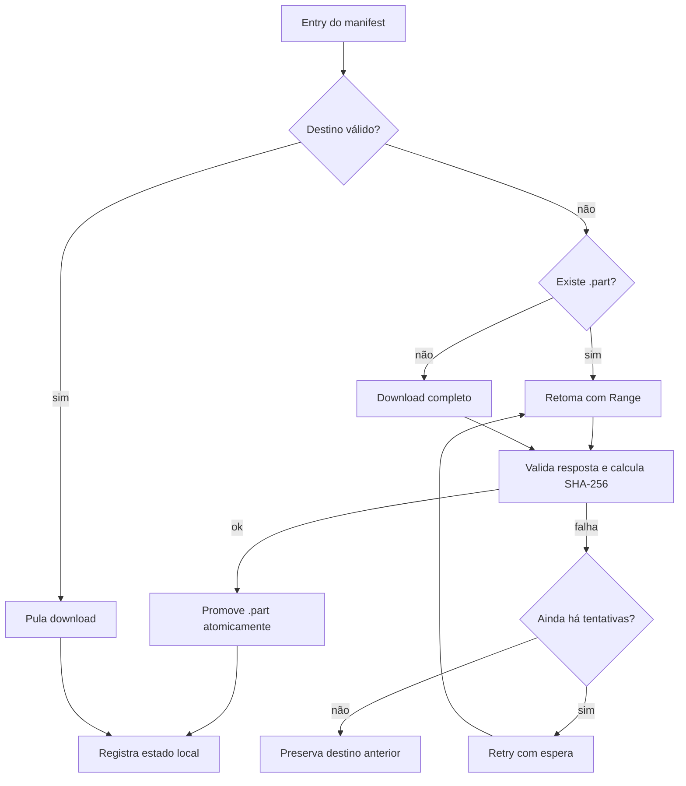
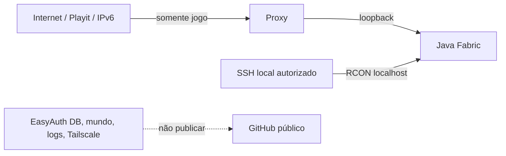
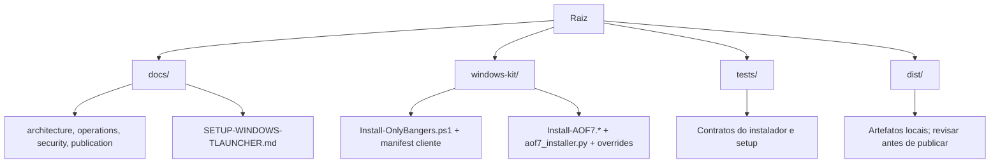

# Arquitetura

Documento descreve duas camadas relacionadas: kit Windows do cliente e
servidor OnlyBangers ativo. O snapshot live foi coletado em 15/09/2026 por SSH
somente leitura.

## 1. Topologia live

O processo Java escuta localmente. Playit fornece a entrada pública; o caminho
IPv6 direto chega ao proxy de loopback. RCON não fica exposto na Internet.

## 2. Componentes e limites

| Componente | Responsabilidade | Limite |
| --- | --- | --- |
| TLauncher/Fabric | Inicia cliente compatível e carrega os 51 jars. | Não recebe EasyAuth, RCON, mundo ou configs server-only. |
| Playit | Encaminha entrada pública até o host. | Não substitui autenticação do jogo. |
| IPv6 proxy | Encaminha IPv6 para loopback IPv4 do Java. | Não é servidor Minecraft nem banco. |
| Fabric/Java | Executa gameplay, rede, mods e mundo. | Não expõe RCON publicamente. |
| EasyAuth | Autentica jogadores em modo offline. | Não é conta Microsoft nem validação Mojang. |
| Spark | Mede TPS, CPU, memória, rede e disco. | Mede estado; não corrige gargalos sozinho. |
| Kit Windows | Valida versões, jars e SHA-512 antes de copiar cliente. | Não instala nem administra o servidor Linux. |

## 3. Fluxo do cliente

Minecraft não usa WebSocket nesta topologia. WebSocket manteria uma conexão
bidirecional sobre HTTP para consumidores web; seria uma extensão possível para
um painel de administração, não uma dependência do jogo atual.

## 4. Kit Windows

O instalador atual copia apenas os jars cliente e rejeita JEI/EasyAuth. O
instalador AOF7 legado ainda existe em `windows-kit/` para preservar o fluxo
histórico de download e testes de retomada; ele não define a versão live.

## 5. Download seguro do kit legado

O manifest legado valida HTTPS, caminho relativo e versão. O SHA-256 gravado é
evidência dos bytes recebidos; sem digest esperado no manifest, não é prova
independente de autenticidade.

## 6. Otimização e observabilidade

| Grupo | Mods | Função documentada |
| --- | --- | --- |
| Tick/game logic | Lithium, ModernFix, ServerCore | Reduzir trabalho repetido e melhorar estabilidade. |
| Chunks/worldgen | C2ME, Chunky, Ksyxis, LazyDFU | Geração, preparação e inicialização mais previsíveis. |
| Memória/startup | FerriteCore, ModernFix, MemoryLeakFix, Clumps | Reduzir custo de memória e ruído de inicialização. |
| Rede | Krypton, VMP | Otimizar caminhos de rede do servidor. |
| Medição | Spark, Fabric Carpet | Medir TPS e investigar gargalos. |

Spark registrou TPS próximo de 20, CPU do processo em torno de 2–5% e heap
entre 1.1 e 2.7 GB de 6 GB nos relatórios observados. Esses números são
snapshot, não garantia de carga futura.

## 7. Segurança e estado systemd

O serviço aplica `NoNewPrivileges=true`, `PrivateTmp=true`, `UMask=0077`,
`LimitNOFILE=65536` e `OOMScoreAdjust=-800` no drop-in ativo. Foi encontrado
um fragmento base que ainda cita jar 1.21.1, enquanto o drop-in executado cita
1.20.1; systemd alerta que a unidade carregada está desatualizada. A correção
deve ocorrer em janela operacional futura, com validação do arquivo efetivo;
esta auditoria não alterou o host.

## 8. Mapa do repositório

Mermaid fica inline para renderização nativa do GitHub. ZIPs, jars, logs,
backups, bancos e mundo não fazem parte da fronteira pública.
