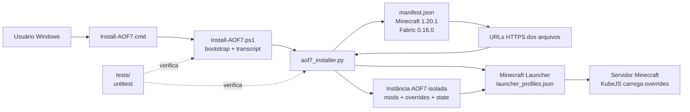
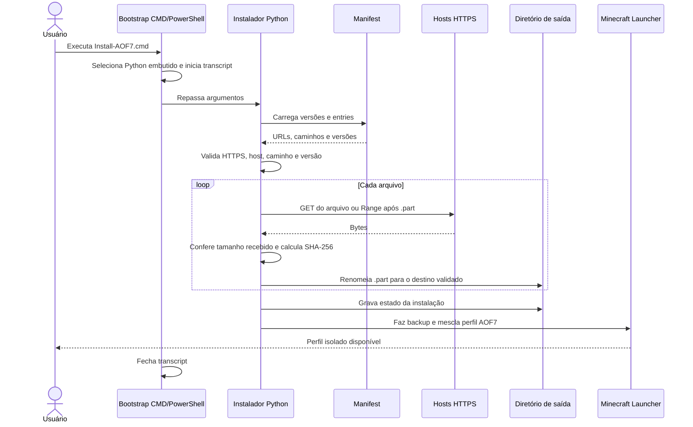
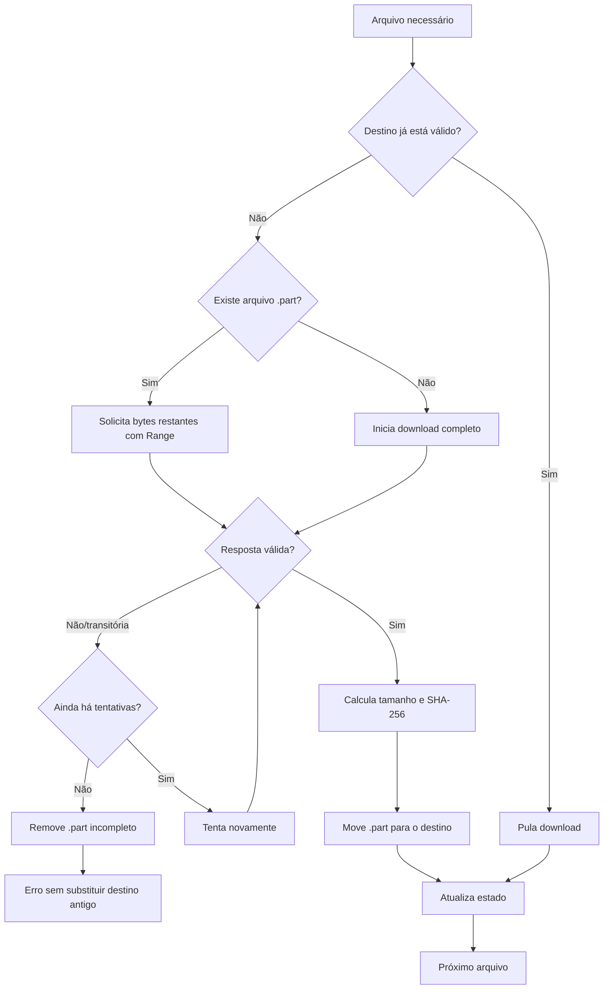
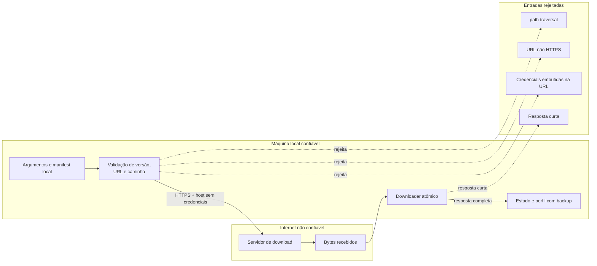
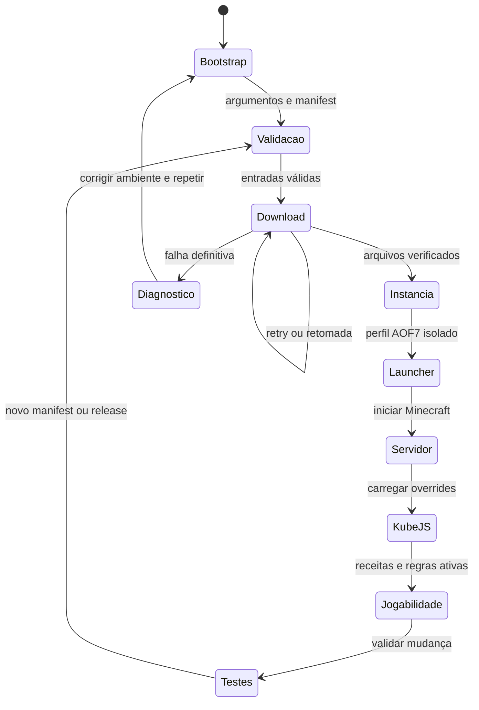
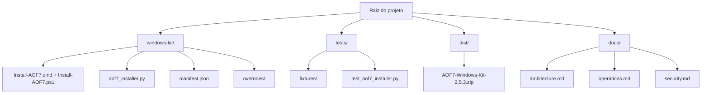

# Arquitetura

Este documento descreve o fluxo real do AOF7 Windows Kit. O projeto é um
instalador local: não há API própria, banco de dados ou serviço intermediário.
O manifest declara o que deve ser baixado; o instalador valida, materializa e
registra a instância do Minecraft.

## 1. Visão geral dos componentes

### Responsabilidade de cada componente

| Componente | Faz | Não faz |
| --- | --- | --- |
| `Install-AOF7.cmd` | Oferece uma entrada simples e repassa argumentos. | Não baixa arquivos nem interpreta o manifest. |
| `Install-AOF7.ps1` | Prepara Python embutido, chama o instalador e grava `logs\\install.log`. | Não substitui a validação do instalador Python. |
| `aof7_installer.py` | Valida entradas, baixa, verifica, grava estado e mescla o perfil. | Não é um servidor web nem gerencia contas do Minecraft. |
| `manifest.json` | Declara versões e arquivos esperados. | Não executa código. |
| `overrides/` | Fornece alterações da instância, como scripts KubeJS. | Não altera o código do instalador. |
| `tests/` | Exercita segurança, downloads e bootstrap. | Não substitui uma instalação real no Windows. |

## 2. Sequência de uma instalação normal

O destino só é substituído depois que a resposta termina conforme o tamanho
declarado quando esse cabeçalho existe. O SHA-256 é registrado no estado local;
o manifest atual não fornece um digest esperado para rejeição independente.
Isso permite repetir a instalação sem destruir um arquivo válido.

## 3. Falhas, retry e retomada

O arquivo `.part` é temporário e não é um resultado publicável. Em uma falha
definitiva, o arquivo anterior permanece intacto e a exceção torna o problema
visível ao operador.

## 4. Fronteiras de confiança e controles

Controles importantes:

- `safe_join` impede que o caminho de uma entry escape do diretório de saída.
- URLs com esquema inseguro ou credenciais são rejeitadas antes do download.
- O tamanho da resposta detecta downloads curtos; o SHA-256 recebido é
  registrado no estado para auditoria local.
- O manifest atual não contém hashes esperados, portanto o digest não é uma
  prova independente de autenticidade.
- A gravação usa arquivo temporário e substituição atômica.
- O perfil existente do Launcher recebe backup antes da mesclagem.

## 5. Ciclo de operação

O diretório de saída é a fronteira da instância. Os overrides KubeJS são
carregados pelo servidor Minecraft durante o ciclo normal; eles não são
executados pelo bootstrap nem pelo downloader.

## 6. Mapa de diretórios

O manifest completo contém 436 entries; ele é uma fonte de dados e por isso
fica agrupado no mapa em vez de ser expandido em um diagrama ilegível.

## Decisões e limites

- A arquitetura é local e orientada a arquivos; não há serviço central a
  manter.
- O retry é deliberadamente limitado ao downloader existente; observabilidade
  detalhada de cada host ou uma fila distribuída não fazem parte do kit.
- Mermaid foi escolhido porque é renderizado pelo GitHub e mantém os diagramas
  revisáveis como texto.
